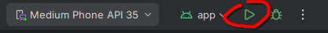
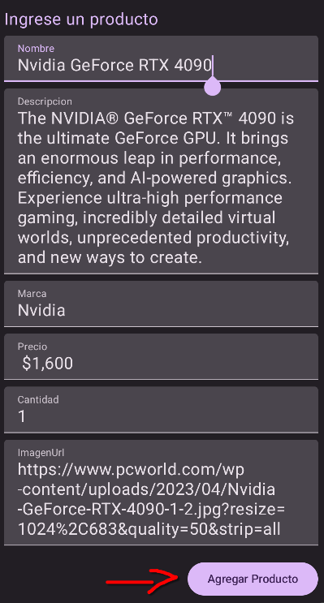

Repositorio Proyecto: [https://github.com/UB3721/UAA-PAPDM-Grupo-1-TP-1 ](https://github.com/UB3721/UAA-PAPDM-Grupo-1-TP-1)Grupo 1

Integrantes:

- Daniel de Jesús Franco Lezcano
- Elías Gabriel Sanchez Ovelar

**La estructura del proyecto consta de los siguientes elementos**

**MainActivity**

Utilizando el tema implementado, aqui es donde se llama a AplicacionProductos, explicada en el siguiente ítem.

**AplicacionProductos**

Contiene todos los estados utilizados. Se utiliza un Column en el que se creará el formulario y donde se pintará la lista de productos agregados.

**FormularioDeProductos**

Recibe los estados y funciones en cambio como parámetros. En el Column, usando Text se coloca el título del formulario. Luego en los TextField se ubican los campos a rellenar del formulario (nombre, descripcion, marca, precio, cantidad, imagenURL) con sus respectivos onValueChange. Aquí es dónde el usuario cargará los datos deseados. Todos separados con un Spacer.

Finalmente, al añadir todos los campos necesarios, se encuentra el botón Agregar Producto, que utilizará onAgregarProducto para añadir a la lista de productos los valores del formulario.

**ListaDeProductos**

En un LazyColumn se crearán las tarjetas que contienen la información de los productos en base a la lista de productos existentes. Cada vez que se añade o elimina un elemento a esta lista, las tarjetas se volverán a pintar.

**TarjetaDeProducto**

Recibe un producto a pintar y la función para remover un producto. Dentro de un Card se coloca el nombre del producto y en un BoxWithConstraints, utilizando un LazyRow se mostrará los valores de los campos del producto mediante la función InfoProducto que será explicada en el siguiente punto. Siguiendo en Card, una vez agregada toda la info del producto dentro de un Row que ocupa todo el width de la tarjeta, ubicado al final, se encuentra un botón que eliminará el producto utilizando la función de remover un producto pasada en los parámetros.

**InfoProducto**

Recibe el titulo a colocar en la info, el valor, el ancho y si es imagen. Se coloca el título, en caso de que sea imagen se utiliza AsyncImage para agregarla utilizando el valor de la imagenURL, usando un drawable como placeholder y otro como error, mostrados en estos respectivos casos. Si no es imagen, dentro de un Box se agrega el valor, en caso de que sea largo en contenido, se utiliza verticalScroll para permitir scrollear el texto (ej. la descripción es muy larga).

**Como ejecutar la aplicación**

Una vez en android studio, se crea un nuevo proyecto de la siguiente manera.

Se agrega la url ubicada al comienzo de este archivo para obtener el repositorio y se elige el directorio de destino.

Una vez descargado el proyecto y sincronizado el gradle.

Darle click al botón Run “App” y esperar que se inicialice el emulador.

Dentro del programa se encontrará el siguiente formulario vacío, rellenar con los datos deseados

Datos de ejemplo 

Nombre: Nvidia GeForce RTX 4090

Descripcion: The NVIDIA® GeForce RTX™ 4090 is the ultimate GeForce  GPU. It brings an enormous leap in performance, efficiency, and AI-powered  graphics. Experience ultra-high performance gaming, incredibly detailed  virtual worlds, unprecedented productivity, and new ways to create.

Marca: Nvidia Precio: $1,600 Cantidad: 1

ImagenURL: [https://www.pcworld.com/wp-content/uploads/2023/04/Nvidia-](https://www.pcworld.com/wp-content/uploads/2023/04/Nvidia-GeForce-RTX-4090-1-2.jpg?resize=1024%2C683&quality=50&strip=all) [GeForce-RTX-4090-1-2.jpg?resize=1024%2C683&quality=50&strip=all](https://www.pcworld.com/wp-content/uploads/2023/04/Nvidia-GeForce-RTX-4090-1-2.jpg?resize=1024%2C683&quality=50&strip=all)

Una vez cargados los datos apretar el botón Agregar Producto

Junto al nombre, se pueden visualizar los datos de forma horizontal, primero la descripcion, luego la marca, precio, cantidad y finalmente la imagen (Una vez cargada y si se pudo obtener exitosamente, de otra manera, se mostrará el drawable de placeholder hasta que la obtenga o de error si no se pudo obtener).

Ejemplo descripción (El cual es scrolleable en este caso) e imagen:

 

La última función es que se puede apretar el botón eliminar que se ve en las imagenes anteriores para sacar este producto de la lista de tarjetas de productos.
